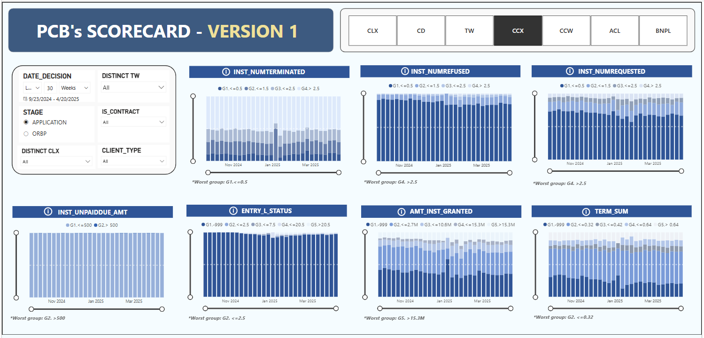
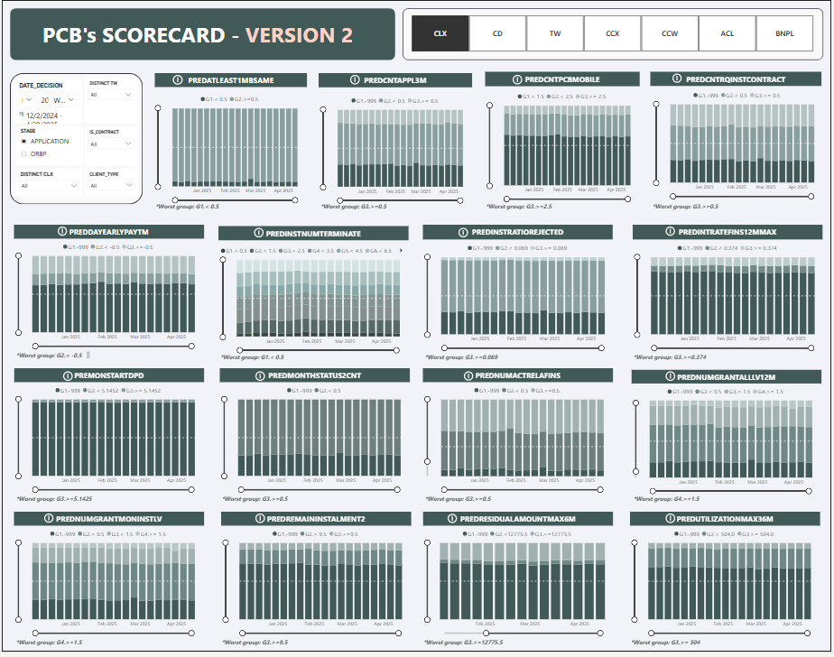

# 📊 PCB Scorecard Report

## Overview
This repository contains the PCB Scorecard Report, a detailed dashboard displaying the **distribution of scorecard risk pillars across credit model predictors**, based on client credit history data sourced from the PCB (Credit Bureau).

The report is designed to help credit risk teams monitor input stability, detect early signs of model drift, and better understand predictor behavior over time.

---

## 🔍 Report Features

### ✅ Interactive Filters
- **Date Range** (`DATE_DECISION`)
- **Stage Selection**: `Application` or `ORBP - Online Based Processing`
- **Contract Status**, **Client Type**, and **Product Dimensions** (CLX, TW, CCX, CCW, ACL, BNPL)

### 📈 Predictor Visualizations
Each visualization shows the time-series distribution of clients across **Bin groups (G1 to G5)** for a specific predictor. The lowest-performing group is labeled as the **worst group** for ease of risk identification.

---

## 📷 Screenshots
### Demo

### Version 1  

### Version 2  

---
## 🧩 Scorecard Versions

### Version 1: 7 predictors
- `INST_NUMTERMINATED`
- `INST_NUMREFUSED`
- `INST_NUMREQUESTED`
- `INST_UNPAIDDUE_AMT`
- `ENTRY_I_STATUS`
- `AMT_INST_GRANTED`
- `TERM_SUM`

### Version 2: 16 predictors
- `PREDCNTAPPL3M`, `PREDCNTPCBMOBILE`
- `PREDNUMACTRELAINS`, `PREDNUMGRANTALLV12M`
- `PREDDAYEARLYPAYTM`, `PREDINTRATEFINS12MMAX`
- `PREMONSTARTDPD`, `PREMONTHSTATUS2CNT`
- `PREDINSTNUMTERMINATE`, `PREDINSTRATIOREJECTED`
- `PREDATLEAST1MBSAME`, `PREDCNTRQINSTCONTRACT`
- `PREDNUMGRANTMONINSTLV`, `PREDREMAININSTALMENT2`
- 'PREDRESIDUALAMOUNTMAX6M`, `PREDUTILIZATIONMAX36M`

---

## 👥 Intended Users
This report is designed for:
- **Credit Risk Analysts**
- **Data Scientists**
- **Model Monitoring & Governance Teams**

---

## 🎯 Use Cases
- Monitor predictor distribution shifts over time
- Detect model drift and changes in applicant profiles
- Track performance of high-risk segments
- Ensure input feature stability for production scorecards
- Support internal model validation and regulatory compliance

---

## 📌 Notes
- PCB = Personal Credit Bureau
- All predictor distributions are based on historical client-level data

---

